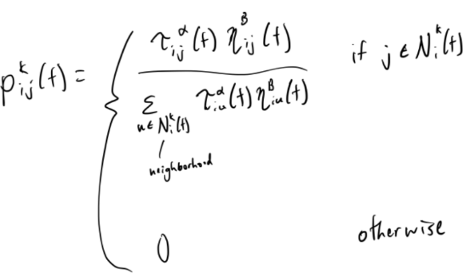
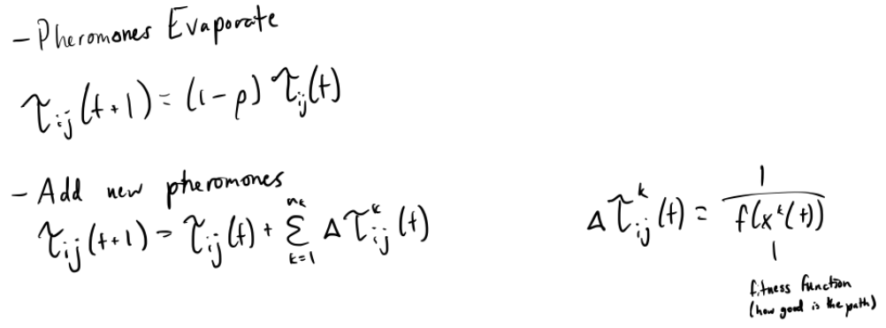
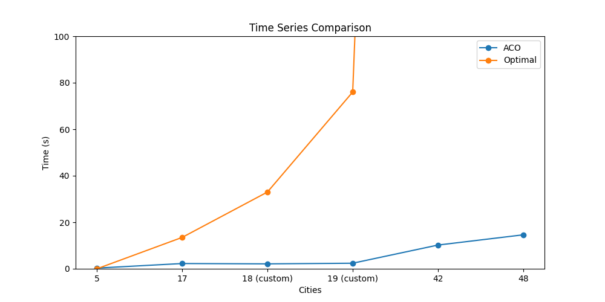
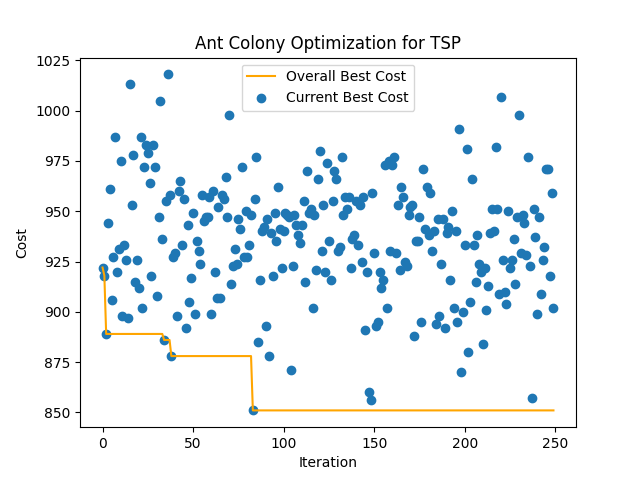

# TSP-Ant-Colony-Optimization
## Introduction / Problem Description
In this report, I will go over my approach to solving the Traveling Salesman Problem (TSP) using Ant Colony Optimization.

The Traveling Salesman Problem is a problem in which there are different interconnected cities that a salesman has to traverse. The goal of the problem is to find the shortest path the salesman can travel through to visit all the cities. Some key assumptions about the problem are that all cities are connected/reachable and that paths are undirected. While the problem seems simple conceptually, the brute force solution of trying all permutations of cities scales very poorly as the number of cities N increases, achieving an O(N!) time complexity.

My approach is to use Ant Colony Optimization (ACO) to solve TSP efficiently. ACO is meant to mimic the behavior of ants in order to solve combinatorial path optimization problems. In ACO, ants lay down pheromones which in combination with distance influences the paths other ants choose. Although this approach doesn’t explore all the possible paths the salesman can travel, it should provide a “good enough” solution in a reasonable amount of time. Throughout the following sections, I detail my personal findings as I implement an ACO algorithm to solve the Traveling Salesman Problem.

## Technical Description
Ant Colony Optimization was first introduced by Marco Dorigo in the 1990s. As described earlier, the algorithm is meant to mimic the behavior of ants foraging for food. How the overall algorithm works is that in each iteration, a set number of ants will be initialized and each ant will independently traverse the graph. Based on the path lengths of each ant, the pheromones will be updated and the next iteration starts. This repeats as long as the algorithm user wants and returns the shortest path from any of the iterations.

The first step in each iteration is having the ants traverse the graph until all cities have been visited. When an ant selects the next edge to traverse, there are two main things it takes into account:
- Pheromones – τij​ represents the pheromone value of the edge
- Desirability – ηij​ is a heuristic for how inherently desirable an edge is and can be taken to be the inverse of the distance of the edge

The ant factors in pheromones and desirability when randomly choosing the next edge using the probabilities given by this formula:



The probabilistic selection element of the algorithm is essential to its success because it accounts for the inaccuracies for the pheromone and desirability values. Stronger pheromones don’t guarantee that those edges are correct, and desirability is a very rough heuristic for how long the path length will be. The point of the algorithm is to point the ants to the most optimal solution by making incremental improvements.

After all the ants have traversed the path, the pheromones are updated based on the ants’ paths. Pheromones are first evaporated at a predefined rate. This ensures that the effect of the results from the previous iterations are dampened and the new iteration’s results are weighed more heavily. After evaporation, new pheromones are deposited on each edge based on the inverses of the path lengths running through the edge. As a result, edges on shorter paths will have more pheromones deposited on them and will be more likely to be selected in the future.


At the end of the algorithm’s iterations, the pheromones should push the solution closer to the optimal path. The best solution throughout all the iterations will be the one returned to the user.

## Algorithm Design
Include a well-organized presentation of your EA algorithm design and how it is tailored to address your specific research problem. You can use pseudocode to describe the step-by-step process, and flow diagrams to visualize the workflow of the algorithm. Break down the EA algorithm into distinct modules or functions, showing how each part contributes to the experimental design. Emphasize the rationale behind your choices, such as parameter settings, selection mechanisms, and termination criteria, and how these decisions are intended to yield insights that directly answer your project's research question.

In this section, I detail how I implemented the algorithm programmatically.

The overarching function was implemented with this general structure where for each iteration, each ant constructs a path and pheromones are updated at the end of the iteration. Note that the graph is defined globally for all functions to use.
```python
def tsp(ants, alpha, beta, rho, limit=150)
    pheromones = 2D matrix of randomly generated weights between 0 and 1
    overall_best_path = empty array
    overall_best_cost = infinity
   
    for limit iterations
        paths = []
        for each ant
            construct_path(pheromones, alpha, beta)
            if path_cost(path) < overall_best_cost
			overall_best_path = path
			overall_best_cost = path_cost(path)
        update_pheromones(pheromones, paths, rho)
```
This structure clearly illustrates the overall algorithm while abstracting away the implementation details of path construction and pheromone updates.

Each ant constructs a path that visits every city in the graph. To construct the path, the function stores a list indicating whether the city corresponding to each index is visited. The first city is randomly chosen, and each city is chosen next until no more cities are unvisited.
```python
def construct_path(pheromones, alpha, beta)
    path = [random city for 0 to len(graph) - 1]
    visited = [False] * len(graph)
    visited[path[0]] = True
   
    for len(graph) - 1 iterations
        current = last element of path
        next_city = pick_next(pheromones, visited, current, alpha, beta)
        add next_city to path
        mark next_city as visited


    add starting city to the path
    return path
```
The pick next function, while conceptually easy to grasp, is a bit convoluted in its programmatic implementation. The idea for this implementation is that the individual pheromone-desirability expression and total sum is calculated to then calculate the probability of choosing each edge. Then, a random number from 0 to 1 is chosen, and the list of individual probabilities is iterated over with each probability subtracted from the previously chosen random number. When that random number hits 0, the current edge is chosen as the next edge in the path.
```python
def pick_next(pheromones, visited, current, alpha, beta)
    unvisited = [indices that aren’t in visited]
    probs = [0] * len(graph)
   
    for i in unvisited
        probs[i] = pheromones[current][i] ** alpha) * desirability[current][i] ** beta
   
    total = sum of probs
    if total == 0
        return any element in unvisited
    divide all probs by total
   
    r = random float from 0 to 1
    for i in len(probs)
        r -= probs[i]
        if r <= 0
            return i
   
    return unvisited[-1]
```
After the paths for all the ants have been constructed, these paths are then passed to the update_pheromones function, which calculates the change in pheromones for each edge in the paths. It factors in the evaporation rate as well and updates the pheromones for all edges accordingly.
```python
def update_pheromones(pheromones, paths, rho)
    pheromone_delta = dictionary
    for path in paths
        cost = path_cost(path)
        for i in len(path) - 1
            add 1 / cost to pheromone_delta[(path[i], path[i + 1])]
   
    for i in len(pheromones)
        for j in len(pheromones)
            pheromones[i][j] = (1 - rho) * pheromones[i][j] + pheromone_delta[(i, j)]
```
These are the main functions this implementation incorporates. By modularizing the algorithm into separate functions, this program aims to make the implementation as accurate as possible to the Technical Description section while maintaining readability by abstracting away complexity.

Implementing TSP with hyperparameters as function arguments was also beneficial for hyperparameter optimization with pre-existing libraries. For this implementation, I used the Optuna library (https://github.com/optuna/optuna) for hyperparameter selection. This library uses techniques like Bayesian optimization to explore the parameter space. The results are further detailed in the following sections.

## Experiments / Analysis
### Graph Size
The first experiment I ran was with various graph sizes with different ranges of edge weights. The reason I wanted to run this experiment was to see how the ACO algorithm handled increased problem complexity as size increases.

I used a dataset from Florida State University (https://people.sc.fsu.edu/~jburkardt/datasets/tsp/tsp.html) containing text files with 2D adjacency matrices storing the weights between pairs of edges. I chose four sets of data:
5 cities with weights in the single digits
17 cities with weights in the triple digits
42 cities with weights in the double digits and low triple digits
48 cities with weights in the quadruple digits
Here were the results after running the experiments with the optimal set of parameters (described later in this section).
| Dataset    | Actual Answer | ACO Answer |
|------------|---------------|------------|
| 5 cities   | 19            | 19         |
| 17 cities  | 2085          | 2096       |
| 42 cities  | 699           | 863        |
| 48 cities  | 33523         | 39398      |

From this table, we can see that for the simple problem with 5 cities, the ACO algorithm was able to come up with the correct answer. However, as the number of cities increased, the ACO answer gradually diverged from the actual answer. This means that the greater the size of our dataset, the more inaccurate the ACO estimate will be. This is expected since with a larger dataset comes a larger solution space to explore. In order for this experiment to be more meaningful, we also have to take runtime performance into account to see if the performance gains justify the difference in actual vs estimated answers.

### Runtime
Next, I wanted to see the difference in runtime between the ACO algorithm and the best algorithm for finding the shortest path in TSP. The reason I wanted to run this experiment was to see if the ACO approach was actually significantly more efficient in runtime than the optimal algorithm.


Clearly we can see that the ACO algorithm scales significantly better than the optimal algorithm. Even for low numbers of cities, the ACO algorithm still performs better than the optimal algorithm. This is due to the ACO algorithm's polynomial time complexity as opposed to the optimal algorithm’s exponential time complexity. We see that even for a small jump from 18 to 19 cities, the time taken for the optimal algorithm more than doubles, while there is virtually no change for the ACO algorithm. In many cases, this makes ACO more practical to use than the optimal algorithm.

### Convergence
I also wanted to see the rate at which the algorithm improved its solution over each iteration. This is relevant in choosing an appropriate number of iterations after which to terminate the algorithm. In this experiment, I recorded the overall best path cost and the current iteration’s best path cost for each iteration.


This experiment was more of a sanity check to see how well the ACO algorithm converged. Truthfully, I was expecting to see the current best cost points converge more quickly to the actual answer of 699 but there was only a slight trend downwards. This exposes the limitations of the ACO problem’s design since there is inherently randomness and inaccuracies in the heuristics that reduces the algorithm's ability to find the best solution.

### Hyperparameter Values
As an extension of the previous experiment, I wanted to test out all the different hyperparameter values – number of ant, alpha, beta, rho, iteration limit – to find out what set of hyperparameters were optimal. Clearly, certain sets of hyperparameters would give us better results than others, and my goal with this experiment was to find the set that would give us the best results the most consistently.

To perform this experiment, I used the Optuna library mentioned previously (https://github.com/optuna/optuna). This used various optimization strategies to find a good set of hyperparameters without exploring every combination of parameters. Here are some of the results:

Shortest distance found at each trial of hyperparameters over 100 trials


Hyperparameter importance


Best parameters


The Optuna library gave very interesting metrics for the hyperparameter optimization. One really interesting finding was that the number of ants had a significantly lower impact on the accuracy of the algorithm than the other hyperparameter. This indicates that increasing ants doesn’t necessarily proportionally increase algorithm performance, and that most of the improvement is done during the pheromone update stage. In other words, exploration is more important than exploitation for this algorithm.

Another interesting finding was that alpha was much less important than beta. Alpha is the parameter that scales up the impact of existing pheromones and beta is the parameter affecting the impact of desirability. This finding further confirms the conclusion that exploration is more important than exploitation for this problem since the effect of existing pheromones isn’t as important to the solution as the edge weights.

To even further drive home that conclusion, we also see that rho, the evaporation rate, is important, and increasing rho dampens the effect of existing pheromones.

Finally, this experiment found a set of optimal parameters that was used in most of the experiments done in this report. Increasing the limit never hurts the best solution, so in some instances I increased it to 250. Also, the high value of beta confirms my own experimental findings that higher beta can lead to better results.

## Conclusion and Future Work
In conclusion, I found that Ant Colony Optimization is a viable approach to solving the Traveling Salesman Problem. While the approach does have its limitations, it still performs much better than finding the optimal solution. For most situations where a “good enough” solution is fine and a reasonable runtime is expected, this implementation of ACO on the TSP would work very well.

In the future, there are many opportunities for expanding on this work. For one, the finding that beta is much more impactful than alpha could be explored further. What if we incorporated a slightly more accurate heuristic than desirability, which is just the inverse of an edge weight? Another interesting topic to look into would be a more in-depth hyperparameter tuning operation. At what point does increasing beta detriment the algorithm? Can we get the algorithm’s “current best cost” points to converge better i.e. be more exploitative? Answering these questions may bring us closer to solving the Traveling Salesman Problem once and for all.
