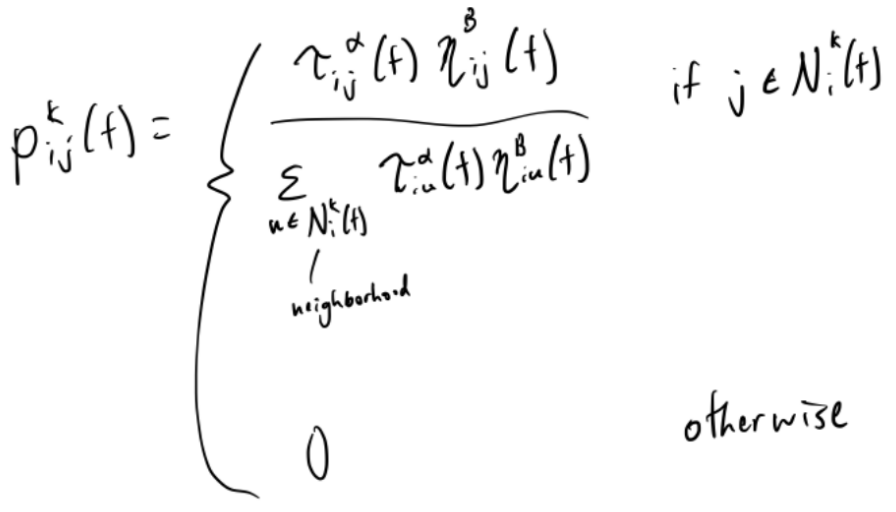

# TSP-Ant-Colony-Optimization
## Introduction / Problem Description
In this report, I will go over my approach to solving the Traveling Salesman Problem (TSP) using Ant Colony Optimization.

The Traveling Salesman Problem is a problem in which there are different interconnected cities that a salesman has to traverse. The goal of the problem is to find the shortest path the salesman can travel through to visit all the cities. Some key assumptions about the problem are that all cities are connected/reachable and that paths are undirected. While the problem seems simple conceptually, the brute force solution of trying all permutations of cities scales very poorly as the number of cities N increases, achieving an O(N!) time complexity.

My approach is to use Ant Colony Optimization (ACO) to solve TSP efficiently. ACO is meant to mimic the behavior of ants in order to solve combinatorial path optimization problems. In ACO, ants lay down pheromones which in combination with distance influences the paths other ants choose. Although this approach doesn’t explore all the possible paths the salesman can travel, it should provide a “good enough” solution in a reasonable amount of time. Throughout the following sections, I detail my personal findings as I implement an ACO algorithm to solve the Traveling Salesman Problem.

## Technical Description
Ant Colony Optimization was first introduced by Marco Dorigo in the 1990s. As described earlier, the algorithm is meant to mimic the behavior of ants foraging for food. When an ant selects the next edge to traverse, there are two main things it takes into account:
Pheromones – τij​ represents the pheromone value of the edge
Desirability – ηij​ is a heuristic for how inherently desirable an edge is and can be taken to be the inverse of the distance of the edge

The ant factors in pheromones and desirability when randomly choosing the next edge using the probabilities given by this formula:

